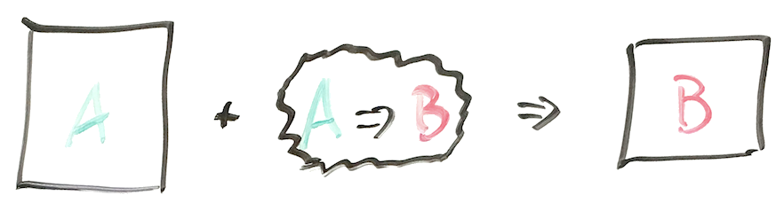
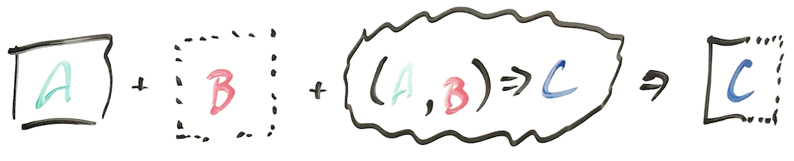
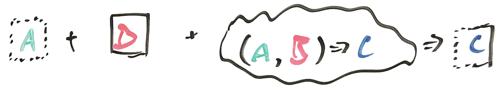
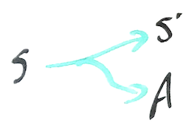
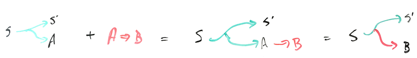
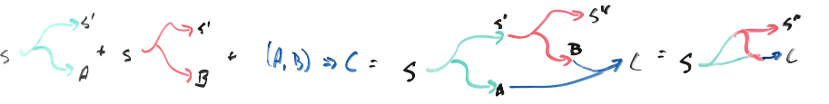
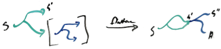
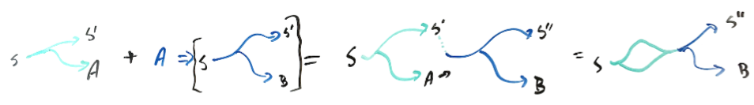

# Functional patterns review

We've seen a few patterns for function application (`map`, `flatMap`, `map2`, ...) repeated in the following contexts:

* `Option[_]` 
* `List[_]`
* `Stream[_]`
* `Rand[_]`
* `State[S,_]`

## Pattern #1: `F[A]` + `(A => B)` gives `F[B]`
We've been calling this pattern `map`.

The box represents the context.  The function applied to the box converts an `A` to `B`.  The function doesn't affect the characteristics of the resulting box in any way.

"Box characteristics" depend on the specific context.  For `Option[_]` the only characteristic is whether or not it contains a value vs being `None`.  For `List[_]`, it's how many values the list contains.  For `Rand[_]`, it's the current RNG seed.  

In later diagrams, the box color or line style represent these "characteristics". Important: it's impossible to affect these characteristics using `map`.

## Pattern 2: `F[A]` + `F[B]` + `((A,B) => C)` gives `F[C]`
We've been calling this pattern `map2`.

In this example, we have two input boxes, and a function that operates on the values they contain.  

The characteristics of the input boxes are combined in an order-dependent way to produce the characteristics of the resulting box.  

The values contained in the resulting box depends only on the function, and the resulting box characteristics depend only on the characteristics of the input boxes.  

## Pattern #3a: Flattening `F[F[A]]` gives `F[A]`

`flatten` converts a boxed boxed value into a singly-boxed value.  The characteristics of the inner and outer box are combined in a box-specific way to yield the characteristics of the final box.

We haven't talked too much about `flatten`, but it is equivalent to `flatMap`.  (i.e. `flatten` can be implemented using `map` and `flatMap`, while `flatMap` can be implemented using `map` and `flatten`.)

## Pattern #3b: `F[A]` + `(A => F[B])` gives `F[B]`
We've been calling this pattern `flatMap`.

The function applied to the box takes an `A` and returns a boxed `B`.  The final box can derive characteristics from the initial box and the box produced by the function.

(Think about how you could implement this using `map` with `flatten`!)

# State
Chapter 6 gave us a model for using FP to implement operations that require and update external state: `State[S,_]` aka `(S => (_, S))`

Rather than a box, the "context" looks something like this:

and `map` in the context of `State[S,_]` looks like this:

# map
`State[S,A]` and `(A => B)` can be combined to yield `State[S,B]`:

## map2
`State[S,A]` and `State[S,B]` and `((A,B) => C)` can be combined to yield `State[S,C]`:

## flatten
`State[S,State[S,A]]` can be flattened to yield `State[S,A]`:

Remember that `flatten` just combines an inner and outer "box" in a context-specific way.  Short of throwing away intermediate `S`, the only way to combine `State[S,_]` is the way illustrated here.

## flatMap
`State[S,A]` and `(A => State[S,B])` can be combined to yield `State[S,B]`:

# Exercises

1. Draw how `sequence` transforms `List[F[A]]` to `F[List[A]]`.

2. Implement `sequence` for `State`. (i.e. finish Exercise 6.10)

3. Do Exercise 6.11, and then repeat it with your own example.